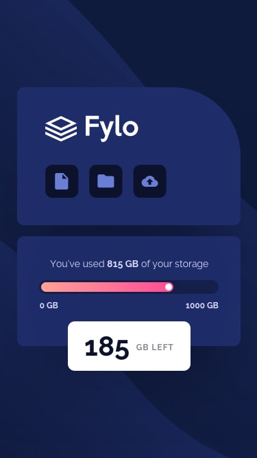

# Frontend Mentor - Fylo data storage component solution

This is a solution to the [Fylo data storage component challenge on Frontend Mentor](https://www.frontendmentor.io/challenges/fylo-data-storage-component-1dZPRbV5n).

## Overview

### The challenge

Users should be able to view the optimal layout for the site depending on their device's screen size.

### Screenshot

### Links

- Solution URL: [Github](https://github.com/jeremylloyd/data-storage-component)
- Live Site URL: 

## My process

### Built with

- HTML
- CSS
- JS (Svelte)

### What I learned

- CSS Container queries
- Svelte Components
- Svelte Stores
